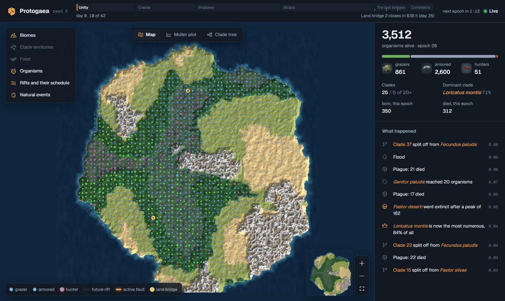

# Protogaea

*A persistent digital evolution world you can watch — and, rarely, touch.*

> **Status: pre-alpha.** The deterministic core and the balance harness (stage A) are nearly done, and the observation stage (B) is under way: a world server keeps the event log and serves a read API, and a web viewer shows the living world on a test server. Nothing is public yet, and everything described here can change. The design is [specification v0.2](docs/spec/spec-v0.2.md).



Protogaea (Russian «Протогея», "proto-Earth") is a continuous digital world where organisms forage, hunt, reproduce, mutate and go extinct, while people watch, form hypotheses and follow the fate of lineages. Most of the time the world runs on its own. Occasionally, naturalists pool **sparks** — proof-of-work computed on their own processors — into public **wishes**. When a wish gathers enough work, it becomes a **miracle**: a small, bounded intervention such as rain over a region, carrying three organisms across a strait, or reviving an extinct clade from the museum.

Season 1, **The Breaking of Pangea**, begins with a single supercontinent that splits apart on a published schedule, isolating populations and letting them diverge.

## What Protogaea is not

- **Not a cryptocurrency.** No token, no NFTs, no earnings, no paid odds. Sparks cannot be saved up, transferred or sold.
- **Not a scientific model of Earth.** It is digital evolution — inheritance, variation and selection — with no claim of realism or of ever-growing complexity.
- **Not hidden computation.** Sparks are kindled only with explicit consent, visibly, and stop with one click.

## How it works

### The world

- A 64 × 64 grid with five land biomes, shallows and deep water.
- Organisms carry a six-trait genome with a fixed budget (movement, perception, plant eating, hunting, defense, fertility), plus behavioral genes and a neutral color gene that makes relatedness visible on the map.
- Times of year, wildfires, floods, droughts and "kill the winner" plagues keep the environment changing. Hunting has cyclic dominance, so no single strategy wins forever.
- One epoch is 12 ticks, nominally five minutes. World time is logical: if the server stops, the world waits.

### Watching

- A live map, a Muller plot of clade shares over time, a clade tree, organism and clade cards, and a time machine.
- "While you were away" digests, subscriptions, a daily chronicle and a museum of extinct clades.
- A hypothesis journal where structured predictions are scored automatically.

### Sparks, wishes and miracles

1. Anyone can create a public wish — for example, `migrate` three hunters to an island — or support someone else's.
2. Naturalists kindle sparks for it on their CPUs (yespower, a CPU-friendly proof of work).
3. Work accumulates on the wish across epochs. When it reaches the price, the wish joins the queue.
4. At most three miracles happen per epoch. The price adjusts like difficulty and never drops below a floor.
5. After a miracle, a counterfactual shows what the world would have looked like without it.

### Verifiable by anyone

- A deterministic, integer-only core. The same code runs on the server, in a command-line replay and in the browser (WASM).
- A public append-only log, hourly snapshots, Merkle state roots and OpenTimestamps anchoring.
- A spark log modeled on Certificate Transparency, committed before the drand beacon round that seeds each epoch.
- Independent watchers. The v0 trust boundary is stated openly in [spec §21](docs/spec/spec-v0.2.md#21-verifiability-and-the-trust-boundary).

## Roadmap

| Stage | Goal | Status |
|---|---|---|
| Spec | Specification v0.2: English canonical, Russian translation | Done |
| A | Deterministic core, WASM build, balance harness, Season 1 map generator | Nearly done: the parameter search for Season 1 is running |
| B | Observation: map, Muller plot, clade tree, time machine, digests | In progress: the world server, the viewer with its map, clade names, the Muller plot, the clade tree, the stories of the day, the "While you were away" digest, the replay of the last day, predictions for tomorrow, the Telegram bot and the time machine (any past epoch recomputed in the browser and checked against the log) are done; next are comparing two moments and the museum |
| B′ | Closed observation test with invited users, no PoW | Planned |
| C | Sparks: yespower, desktop app, WASM client, spark log, watchers | Planned |
| D | Public Season 1 — The Breaking of Pangea | Planned |
| E | Decide what comes next, based on the results | Planned |

Details and exit criteria are in the [roadmap](docs/roadmap.md).

## Documentation

- [Overview](docs/overview.md) — Protogaea in plain words
- [FAQ](docs/faq.md)
- [Specification v0.2](docs/spec/spec-v0.2.md) — canonical ([Russian translation](docs/spec/translations/ru/spec-v0.2.ru.md))
- [Architecture](docs/architecture.md)
- [Spark protocol](docs/protocol.md) — draft
- [World rules](docs/ruleset.md) — draft
- [Glossary](docs/glossary.md)
- [Roadmap](docs/roadmap.md)
- [Decision records](docs/decisions/README.md)
- [Privacy](docs/privacy.md)
- [Translations](docs/translations.md)

The full index is in [docs/README.md](docs/README.md).

## Development

The repository holds four parts:

- [core/](core/README.md): the deterministic simulation core (Rust, no dependencies beyond BLAKE3 and serde; also builds for WASM), with its status against the specification. Season 1 runs in full: times of year, natural events, the Breaking of Pangea, the museum, the spore bank and a Merkle `state_root` with inclusion proofs.
- [harness/](harness/README.md): the balance harness that runs thousands of seasons offline and checks the ecosystem health criteria of spec §28, with its findings, the archetype arena, a benchmark and the parameter search.
- [server/](server/README.md): the world server. It runs the world on a timer, records every epoch, organism, clade and event in SQLite, keeps snapshots, recovers from a crash without losing an epoch, and serves the read API of spec §23.
- [viewer/](viewer/README.md): the web viewer (TypeScript and PixiJS): the illustrated map with live organisms, the season timeline, clade and organism cards, the Muller plot, the clade tree, the event feed and the time machine, with the core compiled to WebAssembly (`viewer/wasm`), in English and Russian.

You need stable Rust, and Node.js and the `wasm32-unknown-unknown` Rust target for the viewer. The server bundles SQLite, so it needs a C compiler (on Windows, MSVC or MSYS2's gcc); a plain `cargo build` leaves it out.

```sh
cargo test --workspace
cargo run --release -p protogaea-harness -- run --seed 1 --days 3      # one world, report in runs/seed-1/report.html
cargo run --release -p protogaea-harness -- sweep --seeds 1..21 --days 42
(cd viewer && npm install && npm run build)
cargo run --release -p protogaea-server -- --seed 5 --viewer viewer/dist # the viewer on http://127.0.0.1:8080
```

CI checks formatting, lints and tests (the server included), builds the viewer, and compares state hashes across x86-64, ARM64, Windows, macOS and WASM.

## Principles

- Watching requires nothing: no registration and no sparks.
- Nobody can change the world without sparks. The only exception is ringing an organism, which does not affect the world.
- No token, no promise of earnings, no NFTs, no sale of influence, no paid odds. Donations give no influence over the world.
- Season rules never change quietly, and the world is never restarted in secret.
- No hidden computation on anyone's device.

## Contributing

The project is in pre-alpha, so we are **not accepting pull requests yet**. Feedback on the specification, ideas and questions are very welcome as issues. See [CONTRIBUTING.md](CONTRIBUTING.md) and the [Code of Conduct](CODE_OF_CONDUCT.md). To report a security problem, follow [SECURITY.md](SECURITY.md).

## License

The specification, the documentation, the simulation core and the balance harness are licensed under the [Apache License 2.0](LICENSE). The world server and the web viewer are licensed under the [GNU AGPL v3.0](server/LICENSE), so anyone who runs a modified copy as a public service must publish their changes. Details are in [LICENSING.md](LICENSING.md). The name and logo are covered by the [trademark policy](TRADEMARKS.md).

## The name

Protogaea means "proto-Earth"; it is also the title of Leibniz's treatise on the early history of the Earth. Pangea is not the name of the project but of the supercontinent in Season 1.

## Languages

English is the canonical language of the project. Русская версия: [README.ru.md](README.ru.md).
