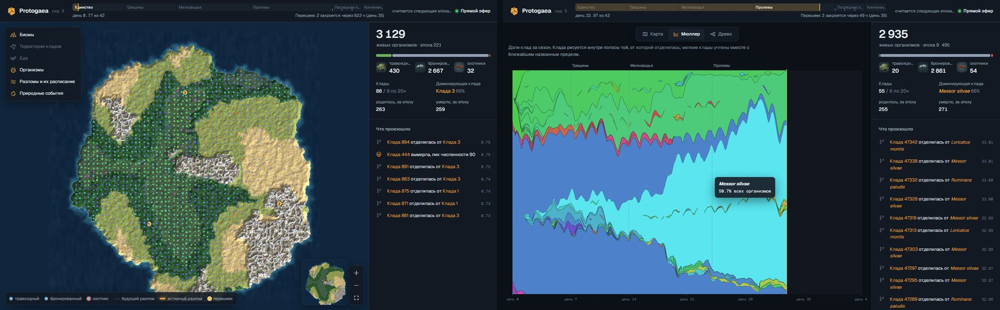

# Протогея (Protogaea)

*Постоянный мир цифровой эволюции, за которым можно наблюдать — и изредка его касаться.*

> Это перевод. Основная версия — [README.md](README.md); при расхождении действует английский текст.

> **Статус: пре-альфа.** Детерминированное ядро и стенд баланса (этап A) почти готовы, идёт этап наблюдения (B): сервер мира ведёт журнал событий и отдаёт API для чтения, а веб-вьювер показывает живой мир на тестовом сервере. Публичного доступа пока нет, и всё описанное здесь может измениться. Замысел — [спецификация v0.2](docs/spec/spec-v0.2.md) ([русский перевод](docs/spec/translations/ru/spec-v0.2.ru.md)).



Протогея («праземля») — непрерывный цифровой мир. Организмы добывают пищу, охотятся, размножаются, мутируют и вымирают, а люди наблюдают, строят гипотезы и следят за судьбой ветвей. Большую часть времени мир живёт сам. Иногда натуралисты объединяют **искры** — доказательства работы, посчитанные на их собственных процессорах, — в публичных **замыслах**. Когда замысел набирает достаточно работы, он становится **чудом**: небольшим ограниченным вмешательством. Например, дождём над регионом, переносом трёх особей через пролив или возрождением вымершей клады из музея.

Сезон 1, **«Раскол Пангеи»**, начинается с единого суперконтинента. Он раскалывается по заранее опубликованному расписанию, популяции оказываются изолированы и расходятся.

## Чем Протогея не является

- **Это не криптовалюта.** Нет токена, NFT, заработка и платных шансов. Искры нельзя накопить, передать или продать.
- **Это не научная модель Земли.** Это цифровая эволюция — наследование, изменчивость и отбор — без претензии на реализм или бесконечный рост сложности.
- **Это не скрытые вычисления.** Искры разжигаются только с явного согласия, это всегда видно, и остановить можно одной кнопкой.

## Как это устроено

### Мир

- Сетка 64 × 64 с пятью биомами суши, мелководьем и глубокой водой.
- У организмов геном из шести признаков с общим бюджетом: передвижение, восприятие, растительноядность, охота, защита, плодовитость. Кроме того, есть поведенческие гены и нейтральный ген цвета: по цвету на карте видно родство.
- Времена года, пожары, паводки, засухи и мор по принципу «бей победителя» не дают среде застыть. Охота устроена как круговое превосходство, поэтому ни одна стратегия не побеждает навсегда.
- Эпоха — 12 тактов, номинально пять минут. Время мира логическое: если сервер остановится, мир подождёт.

### Наблюдение

- Живая карта, диаграмма Мюллера (доли клад во времени), древо клад, карточки особей и клад, машина времени.
- Сводка «Пока вас не было», подписки, летопись дня и музей вымерших клад.
- Журнал гипотез: структурированные прогнозы оцениваются автоматически.

### Искры, замыслы и чудеса

1. Любой может создать публичный замысел — например, переселить (`migrate`) трёх охотников на остров — или поддержать чужой.
2. Натуралисты разжигают для него искры на своих процессорах. Используется yespower — доказательство работы, удобное для CPU.
3. Работа копится на замысле из эпохи в эпоху. Когда она достигает цены, замысел встаёт в очередь.
4. За эпоху исполняется не больше трёх чудес. Цена подстраивается, как сложность, и не опускается ниже нижнего порога.
5. После чуда контрфакт показывает, каким был бы мир без него.

### Проверить может каждый

- Детерминированное ядро на целых числах. Один и тот же код работает на сервере, в реплее из командной строки и в браузере (WASM).
- Публичный журнал, в который можно только дописывать, ежечасные снапшоты, корни деревьев Меркла и привязка ко времени через OpenTimestamps.
- Журнал искр устроен по схеме Certificate Transparency и фиксируется до раунда drand, который задаёт семя эпохи.
- Независимые наблюдатели. Граница доверия v0 честно описана в [разд. 21 спецификации](docs/spec/spec-v0.2.md#21-verifiability-and-the-trust-boundary).

## План работ

| Этап | Цель | Статус |
|---|---|---|
| Спецификация | Спецификация v0.2: английская — основная, русская — перевод | Готово |
| A | Детерминированное ядро, сборка WASM, стенд баланса, генератор карты сезона 1 | Почти готов: идёт подбор параметров сезона 1 |
| B | Наблюдение: карта, диаграмма Мюллера, древо клад, машина времени, сводки | Идёт: готовы сервер мира, вьювер с картой, имена клад, диаграмма Мюллера и древо клад; следующая — машина времени |
| B′ | Закрытый тест наблюдения с приглашёнными, без PoW | Запланирован |
| C | Искры: yespower, настольное приложение, WASM-клиент, журнал искр, наблюдатели | Запланирован |
| D | Публичный сезон 1 — «Раскол Пангеи» | Запланирован |
| E | Решение о дальнейшем развитии по результатам | Запланирован |

Подробности и условия завершения этапов — в [плане работ](docs/roadmap.md) (на английском).

## Документация

Основная документация на английском; оглавление — [docs/README.md](docs/README.md).

- [Спецификация v0.2 на русском](docs/spec/translations/ru/spec-v0.2.ru.md)
- [Исходный черновик v0.1](docs/spec/archive/spec-v0.1.ru.md)
- [Обзор](docs/overview.md) и [FAQ](docs/faq.md) — на английском

## Разработка

В репозитории четыре части (их README на английском):

- [core/](core/README.md) — детерминированное ядро симуляции на Rust, собирается и в WASM; статус относительно спецификации. Сезон 1 идёт целиком: времена года, природные события, раскол Пангеи, музей, банк спор, Merkle `state_root` с доказательствами включения.
- [harness/](harness/README.md) — стенд баланса: тысячи сезонов офлайн с проверкой критериев здоровья экосистемы из разд. 28 спецификации, результаты, арена архетипов, замер производительности и подбор параметров.
- [server/](server/README.md) — сервер мира: ведёт мир по таймеру, пишет каждую эпоху, организм, кладу и событие в SQLite, хранит снимки, переживает падение без потери эпох и отдаёт API для чтения из разд. 23.
- [viewer/](viewer/README.md) — веб-вьювер (TypeScript и PixiJS): иллюстрированная карта с живыми организмами, шкала сезона, карточки клад и особей, диаграмма Мюллера, древо клад и лента событий, на русском и английском.

Нужны стабильный Rust и Node.js для вьювера. Сервер собирает SQLite из исходников, поэтому ему нужен компилятор C (на Windows — MSVC или gcc из MSYS2); обычный `cargo build` его пропускает.

```sh
cargo test --workspace
cargo run --release -p protogaea-harness -- run --seed 1 --days 3      # один мир, отчёт в runs/seed-1/report.html
cargo run --release -p protogaea-harness -- sweep --seeds 1..21 --days 42
(cd viewer && npm install && npm run build)
cargo run --release -p protogaea-server -- --seed 5 --viewer viewer/dist # вьювер на http://127.0.0.1:8080
```

CI проверяет форматирование, линтер и тесты (включая сервер), собирает вьювер и сравнивает хеши состояний на x86-64, ARM64, Windows, macOS и в WASM.

## Принципы

- Чтобы наблюдать, ничего не нужно: ни регистрации, ни искр.
- Никто не может изменить мир без искр. Единственное исключение — кольцевание особи, которое на мир не влияет.
- Нет токена, обещаний заработка, NFT, продажи влияния и платных шансов. Пожертвования не дают влияния на мир.
- Правила сезона никогда не меняются втихую, а мир никогда тайно не перезапускается.
- Никаких скрытых вычислений на чужих устройствах.

## Участие

Проект на стадии пре-альфа, поэтому **пулреквесты пока не принимаются**. Отзывы о спецификации, идеи и вопросы очень нужны — присылайте их как issues, можно по-русски. См. [CONTRIBUTING.md](CONTRIBUTING.md) и [Кодекс поведения](CODE_OF_CONDUCT.md). О проблемах безопасности сообщайте так, как описано в [SECURITY.md](SECURITY.md).

## Лицензия

Спецификация, документация, ядро симуляции и стенд баланса распространяются по [лицензии Apache 2.0](LICENSE). Сервер мира и веб-вьювер — по [GNU AGPL v3.0](server/LICENSE): тот, кто запускает изменённую копию как публичный сервис, обязан опубликовать свои изменения. Подробнее — в [LICENSING.md](LICENSING.md). Название и логотип защищены [правилами использования товарного знака](TRADEMARKS.md).

## Название

Protogaea — «праземля»; так же назывался трактат Лейбница о ранней истории Земли. Пангея — не название проекта, а суперконтинент первого сезона.
