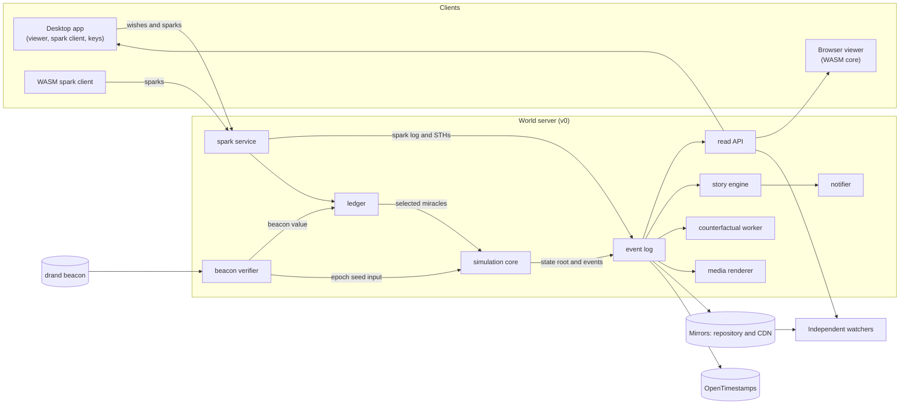
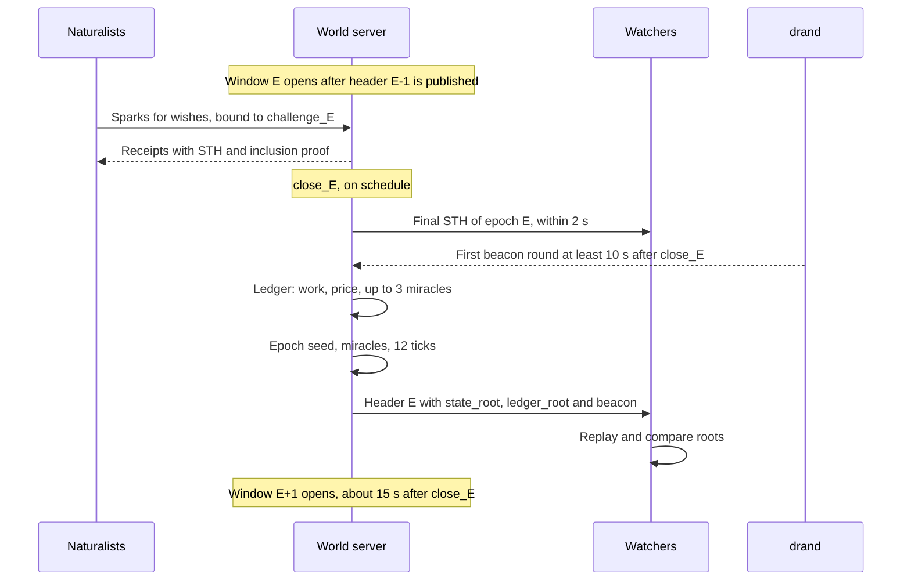

# Architecture

> A summary of [Part IV of the specification](spec/spec-v0.2.md#part-iv-architecture-platforms-operations-openness) with diagrams. The specification is canonical; this page links to it rather than repeating it.

## The shape of the system

In v0, a **single authoritative server** runs the world. Nothing it publishes has to be taken on trust: a deterministic core, shared by the server, a command-line replay and the browser, lets anyone recompute every epoch from the public log.



## Components

| Component | Role | In consensus |
|---|---|---|
| `epoch scheduler` | The window schedule; runs the epoch steps | No |
| `spark service` | Intake of wishes and sparks, PoW verification, the spark log, receipts | The spark log |
| `ledger` | Work per wish, the price, the queue, miracle selection | Yes (`ledger_root`) |
| `beacon verifier` | Fetches and verifies the beacon round | The beacon value |
| `simulation core` | A pure deterministic function in Rust | Yes (`state_root`) |
| `event log` | Headers, events, snapshots, mirrors, time anchoring | Yes |
| `read API` | Indexes, cards, history, proofs | No |
| `story engine` | Story detectors, chronicle, hall of fame | No |
| `counterfactual worker` | Shadow worlds without each miracle, 36 epochs ahead | No, but reproducible |
| `notifier` | Web push, Telegram bot, digests | No |
| `media renderer` | Link previews, GIFs and videos rendered from the replay, the stream | No |
| `watcher` | An independent observer: STHs, headers, replay | No; run by others |

A failure outside consensus — in the web interface, the chronicle or the renderer — cannot damage the world log, and everything outside consensus can be recomputed from the log ([spec §22](spec/spec-v0.2.md#22-architecture-v0)).

## One epoch

Windows close on a fixed schedule every 300 seconds. The key rule: the final set of sparks is committed **before** the beacon value that seeds the epoch is known ([spec §20](spec/spec-v0.2.md#20-epoch-timeline)).



While window E is open, viewers watch a replay of epoch E−1 in real time: the world is broadcast with a delay of one epoch.

## Trust boundary

**Anyone can verify:**
- sparks against their challenge, target and wish;
- the spark log's consistency with every receipt ever issued;
- the ledger's choice of miracles, from the spark log and the beacon value;
- the whole simulation, from genesis, the rules and the miracle log;
- that history was not rewritten, from the header chain and OpenTimestamps.

**The operator can still:**
- refuse a spark — detectable, not preventable;
- delay publication or stop the world — visible, not preventable.

The operator can also kindle sparks, on the same terms as everyone else. Details are in [spec §21](spec/spec-v0.2.md#21-verifiability-and-the-trust-boundary).

## Determinism

The core uses integers only, counter-based randomness, no hash-table iteration, explicit overflow handling and no system time. One codebase is compiled for the server, the replay and WASM, and CI compares state roots across x86-64, ARM64 and browsers on every commit ([spec §14](spec/spec-v0.2.md#14-determinism-and-randomness)).

## Technology

| Area | Choice |
|---|---|
| Core, server, spark client | Rust; yespower through the reference C code via FFI, or a Rust port that passes the same test vectors |
| Viewer | TypeScript with a WebGL renderer (for example, PixiJS) |
| Desktop app | Tauri |
| Indexes | SQLite or PostgreSQL |
| Snapshots and log | Object storage behind a CDN |

## Planned repository layout

```
protogaea/
├── core/          simulation core                         Apache-2.0
├── replay/        command-line replay and verifier        Apache-2.0
├── harness/       balance harness                         Apache-2.0
├── protocol/      wish, spark, spark log and ledger       Apache-2.0
├── spark-client/  native spark client library             Apache-2.0
├── watcher/       independent watcher                     Apache-2.0
├── rulesets/      season rulesets (ruleset.json)          Apache-2.0
├── server/        world server                            AGPL-3.0
├── web/           browser viewer                          AGPL-3.0
├── desktop/       desktop app (includes the viewer)       AGPL-3.0
└── docs/          documentation and specification         Apache-2.0
```

Each directory will get its own `LICENSE` file when it is created; see [LICENSING.md](../LICENSING.md).
