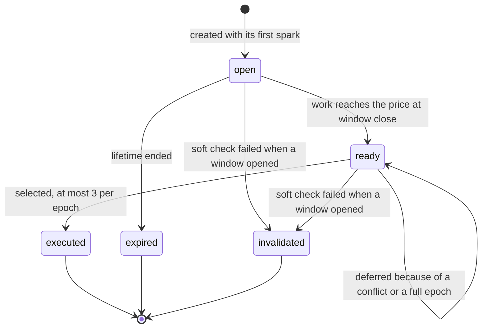

# Spark protocol

> **Status: Draft.** This document will become the protocol specification that [spec Part III](spec/spec-v0.2.md#part-iii-the-spark-protocol-v0) requires before the public client is released. It collects what is decided, down to bytes where possible, and marks open items as **TBD**. Proposed refinements that are not yet in the specification are labeled **Proposed**. Once finalized, the key words MUST, SHOULD and MAY will be used as in RFC 2119.

## 1. Scope

Covered: wishes (proposals), sparks, the spark log and receipts, the ledger (work, price, selection), the epoch timeline, the use of the beacon, the epoch header and error codes.

Not covered: the world rules ([ruleset.md](ruleset.md)) and the transport (HTTP with JSON or a binary encoding — TBD).

## 2. Conventions

- **Hash:** BLAKE3 with a 32-byte output, unless stated otherwise.
- **Signatures:** Ed25519 (RFC 8032) with strict verification: non-canonical `S` is rejected, and so are small-order points. The exact rule is fixed by shared test vectors.
- **Integers:** unsigned, little-endian (`u8`, `u16`, `u32`, `u64`, `u128`). The one exception is the PoW comparison value, read big-endian (§5.3).
- **Concatenation:** `‖` is byte concatenation.
- **World identifier:** `world_id` is 16 bytes, fixed at genesis.

### Domain tags

All tags are ASCII strings without a terminator.

| Tag | Used for | Status |
|---|---|---|
| `PROTOGAEA/PROPOSAL/V0` | `proposal_id` (§4.3) | Decided |
| `PROTOGAEA/SPARK/V0` | PoW input prefix and the yespower `pers` string (§5.2) | Decided |
| `PROTOGAEA/CHALLENGE/V0` | Epoch challenge (§5.1) | Decided |
| `PROTOGAEA/EPOCH_SEED/V0` | Epoch seed (§8) | Decided |
| `PROTOGAEA/RAND/V0` | Counter-based randomness in the core ([ruleset](ruleset.md)) | Decided |
| `PROTOGAEA/SPARK_ID/V0` | `spark_id` (§5.5) | Proposed |
| `PROTOGAEA/STH/V0` | Payload of the STH signature (§6) | Proposed |
| `PROTOGAEA/HEADER/V0` | Payload of the epoch header signature (§9) | Proposed |
| `PROTOGAEA/TIEBREAK/V0` | Ledger tie-break (§7) | Proposed; the spec currently uses `BLAKE3(beacon_E ‖ proposal_id)` without a tag |

## 3. Keys

- **Naturalist key:** an Ed25519 key pair created on the user's device; the 32-byte public key identifies the naturalist.
- **Operator key:** signs STHs and epoch headers. It is published at genesis. Key rotation: TBD.

## 4. Wishes (proposals)

### 4.1 Canonical bytes

The field list is decided; the exact layout is TBD.

| Field | Type (candidate) | Notes |
|---|---|---|
| `version` | `u8` | `0` |
| `world_id` | 16 bytes | |
| `ruleset_id` | 32 bytes | Hash of the season's ruleset ([ruleset.md](ruleset.md)) |
| `action` | `u8` | `0` = `weather`, `1` = `migrate`, `2` = `revive` |
| `params` | per action (§4.2) | |
| `author_pubkey` | 32 bytes | |
| `created_epoch` | `u64` | |
| `expires_epoch` | `u64` | At most `created_epoch + 288` |
| `hypothesis` | optional | Template ID (`u16`) and parameters; encoding TBD |
| `name` | optional | Genus and epithet indexes (`u16` each); `revive` only |

Optional fields are preceded by a presence byte (`0` or `1`) — Proposed.

### 4.2 Action parameters (candidate sizes)

| Action | Parameters |
|---|---|
| `weather` | center `x: u8`, `y: u8`; `kind: u8` (`0` rain, `1` drought) |
| `migrate` | `clade_id: u32`; source area center `x: u8`, `y: u8` (5 × 5 area); target `x: u8`, `y: u8` |
| `revive` | `source: u8` (`0` museum, `1` spore bank); `entry_id: u32`; up to two mutation steps, each a pair `(i: u8, j: u8)`; start `x: u8`, `y: u8` |

### 4.3 Identifier and signature

```
proposal_id = BLAKE3("PROTOGAEA/PROPOSAL/V0" ‖ canonical_bytes)
signature   = Ed25519_sign(author_secret_key, proposal_id)
```

The signature is not part of `proposal_id`, so signature malleability cannot change the identifier or the work bound to it.

### 4.4 Intake and limits

Checks, in order: format → signature → validity of the parameters against the latest published state → limits → the first spark. Limits: at most 3 open wishes per author key; a lifetime of at most 288 epochs. A wish is created only together with its first spark.

### 4.5 Lifecycle



TBD: whether a ready wish that is waiting in the queue can still expire. Proposed: no — once ready, a wish stays queued until it is executed or invalidated.

## 5. Sparks

### 5.1 Challenge

```
challenge_E = BLAKE3("PROTOGAEA/CHALLENGE/V0" ‖ world_id ‖ E ‖ header_hash_{E−1})
```

`E` is encoded as `u64`. The challenge becomes known only when the header of epoch E−1 is published.

### 5.2 PoW input (decided)

```
"PROTOGAEA/SPARK/V0" ‖ world_id (16 B) ‖ epoch (u64 LE) ‖ challenge_E (32 B)
‖ proposal_id (32 B) ‖ miner_pubkey (32 B) ‖ nonce (u64 LE)
```

Algorithm: yespower 1.0, `N = 2048`, `r = 32`, `pers = "PROTOGAEA/SPARK/V0"` — a candidate pending benchmarks ([decision 0013](decisions/0013-yespower-as-candidate-pow.md)).

### 5.3 Validity and weight

- `value` = the first 8 bytes of the yespower output, read as a big-endian `u64`.
- A spark is valid if `value < t_E`, where `t_E` is the epoch target (a `u64` threshold).
- `weight = floor(2^64 / t_E)` work units — the expected number of hash evaluations — stored as `u128`.

### 5.4 Submission

A batch contains up to 64 sparks. Each spark is `{proposal_id (32 B), miner_pubkey (32 B), nonce (8 B)}` — 72 bytes; the epoch is the one whose window is open. Sparks are not signed: the key is part of the PoW input.

TBD: whether to include the epoch explicitly (80 bytes) to remove any ambiguity at window boundaries.

### 5.5 Spark identifier (Proposed)

```
spark_id = BLAKE3("PROTOGAEA/SPARK_ID/V0" ‖ epoch ‖ proposal_id ‖ miner_pubkey ‖ nonce)
```

Used to reject duplicates and to reference receipts.

### 5.6 Intake pipeline

1. Size and format.
2. The epoch window is open.
3. The wish exists and is open.
4. `spark_id` has not been seen.
5. Rate limits per IP, subnet and key (token buckets).
6. One PoW verification.
7. Append to the spark log.
8. Receipt.

An invalid PoW blocks the key and the IP temporarily (candidate: 1 hour). The verification queue is bounded; when it is full, the server responds with `E_OVERLOADED` and `Retry-After`.

### 5.7 Target adjustment (candidate)

`t_E` changes only between epochs. Aim: about 20,000 accepted sparks per epoch across the network; step at most ±25%.

```
t_{E+1} = clamp(t_E × S_target / max(S_E, 1), t_E × 3/4, t_E × 5/4)
```

`S_E` is the number of sparks accepted in epoch E. The arithmetic is integer-only; the rounding rule is TBD. The target bounds the verification load; it does not affect the price of a miracle, which is measured in work units.

## 6. Spark log

- One Merkle tree per epoch, following RFC 6962: leaf hash = `H(0x00 ‖ leaf)`, node hash = `H(0x01 ‖ left ‖ right)`. Hash function: BLAKE3 (candidate; RFC 6962 itself uses SHA-256).
- Leaf encoding: TBD; candidate `epoch ‖ proposal_id ‖ miner_pubkey ‖ nonce`.
- **STH:** `{epoch, tree_size, root, timestamp, signature}`. The timestamp is informational. An STH is published at least every 2 seconds; the final STH of the epoch no later than `close_E + 2 s`.
- **Receipt:** `{spark_id, leaf_index, sth, inclusion_proof}`, issued only after the spark has been written.
- Consistency proofs between any two STHs are available through the API.

## 7. Ledger

Runs once the window of epoch E has closed and `beacon_E` is known. All quantities are integers.

```
for each open wish p:
    W[p] += sum(weight(s) for s in final_tree(E) if s.proposal_id == p)
close wishes whose lifetime ended (expired)

price(p) = P_E × price_mult[action(p)] / 100
ready    = { p : W[p] >= price(p) } ∪ deferred

sort ready by W[p] / price_mult[action(p)], descending      # compare by cross-multiplication
    ties: by BLAKE3(beacon_E ‖ proposal_id)                  # order and tag: TBD

selected = []
for p in ready:
    if len(selected) == 3: break
    if conflicts(p, selected): defer(p); continue
    selected.append(p)

apply selected at the epoch E boundary; mark them executed

if ready wishes remain:     P_{E+1} = P_E + P_E / 8
elif len(selected) < 3:     P_{E+1} = max(P_min, P_E − P_E / 8)
else:                       P_{E+1} = P_E

ledger_root = MerkleRoot(open wishes with W, price, queue)
```

- **Conflicts** ([spec §5](spec/spec-v0.2.md#5-naturalist-actions)): overlapping weather areas, the same clade relocated twice, occupied target cells.
- **Candidates:** `price_mult` = `weather` 100, `migrate` 120, `revive` 200. `P_min` ≈ 8 core-hours of the reference core, expressed in work units after benchmarks.

## 8. Epoch timeline and beacon

The timeline is in [spec §20](spec/spec-v0.2.md#20-epoch-timeline) and in the [architecture diagram](architecture.md#one-epoch).

- **Beacon (candidate):** drand quicknet (a round every 3 s).
- **Round rule (candidate):** `R_E` is the first round whose time is at least `close_E + 10 s`. For drand, round `r` has time `genesis_time + (r − 1) × period`, so `R_E = ceil((close_E + 10 − genesis_time) / period) + 1`.
- **Verification:** the round signature is checked against the network's public key.
- **Delay:** the epoch waits for the round. There is no fallback seed.
- **Epoch seed:**

```
epoch_seed_E = BLAKE3("PROTOGAEA/EPOCH_SEED/V0" ‖ world_id ‖ E ‖ beacon_E ‖ header_hash_{E−1})
```

## 9. Epoch header

Fields ([spec §15](spec/spec-v0.2.md#15-state-snapshots-and-the-log)):

- `epoch`, `prev_header_hash`;
- `ruleset_id`, `state_root`, `ledger_root`;
- the final STH of the spark log;
- `beacon_round`, `beacon_value`;
- the list of applied miracles, `events_root`;
- an informational timestamp.

Encoding: TBD. Signature (Proposed): `Ed25519_sign(operator_key, BLAKE3("PROTOGAEA/HEADER/V0" ‖ header_bytes))`. Once an hour, the header hash is anchored through OpenTimestamps.

## 10. Error codes

| Code | Meaning |
|---|---|
| `E_FORMAT` | Malformed request, wish or spark |
| `E_WINDOW_CLOSED` | The spark arrived after the window closed |
| `E_UNKNOWN_PROPOSAL` | No wish with this `proposal_id` |
| `E_PROPOSAL_CLOSED` | The wish is executed, expired or invalidated |
| `E_DUPLICATE` | This spark was already accepted |
| `E_RATE_LIMIT` | Too many requests from this IP, subnet or key |
| `E_POW_INVALID` | The PoW does not meet the target; the key and IP are blocked temporarily |
| `E_SIGNATURE` | The wish signature is invalid |
| `E_ACTION_INVALID` | The action's parameters are invalid; the response includes a reason |
| `E_BANNED` | The key or IP is temporarily blocked |
| `E_OVERLOADED` | The verification queue is full; retry after `Retry-After` |

## 11. Versioning

- Consensus formats carry a version in their domain tags (`V0`) and in the wish `version` byte. A change to any of them means a new version tag and a new season.
- The HTTP API is versioned by path (`/v0/`).

## 12. Test vectors (TBD)

Planned sets:
- yespower with the `pers` string;
- `proposal_id` and Ed25519 strict verification, including edge cases;
- spark validity at the boundary of the target;
- spark log: leaf and node hashing, STHs, inclusion and consistency proofs;
- ledger scenarios: ties, conflicts, deferrals, price movements, the floor;
- the beacon round mapping.

## 13. Open questions

- Transport encoding (JSON or binary) and the exact byte layouts.
- Leaf encoding of the spark log; the STH and header encodings.
- Tie-break order and tag; whether queued wishes can expire.
- An explicit epoch in spark submissions.
- The rounding rule for target adjustment.
- Rotation of the operator key.
